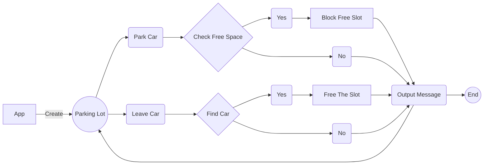

# GoJEK Car Parking 
 **Version 1 . 4 . 2**

## Project Intro

Create parking lot that can hold up to 'n' cars at any given point in time. Each slot is given a number starting at 1 increasing with increasing distance from the entry point in steps of one. I want to create an automated ticketing system that allows my customers to use my parking lot without human intervention. 
Due to government regulation, the system should provide me with the ability to find 
out: 
- Registration numbers of all cars of a particular color. 
- Slot number in which a car with a given registration number is parked. 
- Slot numbers of all slots where a car of a particular color is parked.

 
## Flow chart:

## Installation 
`bin` directory of the project root​ ​ `bin/setup`​ will install dependencies and/or compile the code. Before that please make sure if there is maven installed or you can simply install it by `sudo apt install maven`.
>$ bin/setup

## Test 
You can simply test it through the shell command as given
>$ bin/run_functional_tests

## Run 
Finally to run it please use the shell command as given
>$ bin/parking_lot

## File Structure 

 - bin
	 - setup
	 - run_functional_tests
	 - parking_lot
	 - README
- source
	- fixtures
	- src
	- pom.xml
	- .git
	- .gitignore
	
## Author
Arab Hossain
[GitHub]([https://github.com/arabhossain](https://github.com/arabhossain))
[Facebook](https://www.facebook.com/arabhossain) 
[LinkedIn]([https://www.linkedin.com/in/arabhossain/](https://www.linkedin.com/in/arabhossain/))
